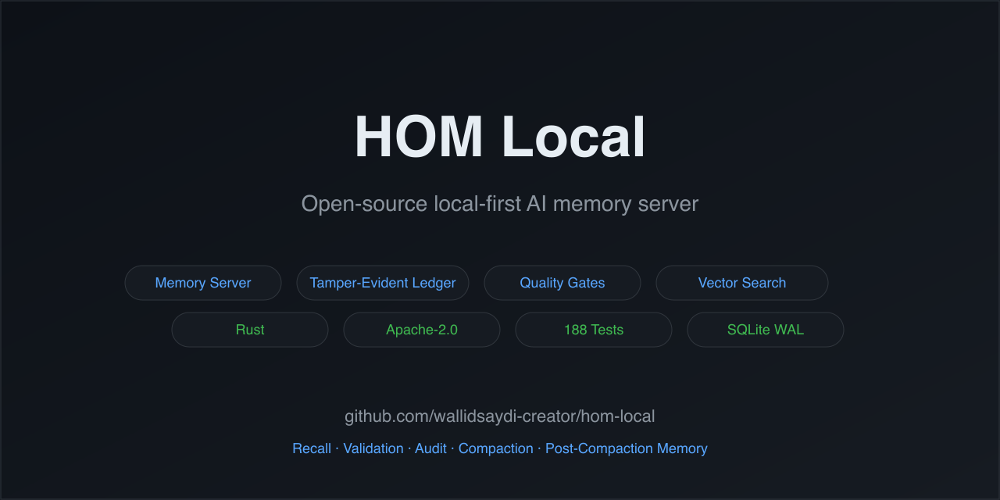

# HOM Local

[](https://github.com/wallidsaydi-creator/hom-local/actions)
[](LICENSE)
[](https://crates.io/crates/hom-brain)

**A local-first memory server for AI agents.**

HOM Local gives your agent a durable brain: structured memory, source-attributed recall, validation gates, context packing, compaction continuity, and a tamper-evident ledger that all run on your machine.



## Stop Paying The Re-Briefing Tax

Every serious AI workflow eventually hits the same wall:

- re-explaining the project
- re-stating decisions
- reminding the model what changed
- copying old context into a new chat
- losing continuity after compaction, session resets, or model switches

That is the re-briefing tax.

HOM Local is built to make that tax smaller. It turns memory into a local backend service that your app, agent harness, or CLI can call directly.

The model can change. The chat can reset. The context window can collapse.

The brain stays local, inspectable, and portable.

## Why This Exists

Most agent memory falls into one of three buckets:

| Approach | What usually happens | What is missing |
|---|---|---|
| Chat history | Context lives inside one conversation | Not portable, not structured, hard to audit |
| Prompt summaries | A long run gets compressed into disposable text | Weak provenance, easy drift, no ledger |
| Vector database alone | Text chunks become searchable | No memory lifecycle, no validation, no continuity model |

HOM Local is different because it treats memory as a system:

- memories have structure
- recall returns evidence
- saves can be quality-gated
- compaction becomes durable continuity
- changes are written to a local ledger
- apps connect through HTTP/IPC instead of depending on one vendor's hidden memory

## Core Guarantees

### Recall

HOM Local stores structured memories and retrieves them with source attribution. Agents can ask the local brain what it knows without relying only on chat history or opaque hosted memory.

### Validation

Before information becomes memory, HOM Local can run quality gates: structure, relevance, substance, and factuality checks. The goal is not to remember everything. The goal is to remember useful context with evidence.

### Audit

Memory mutations are written to a tamper-evident local ledger. Developers can inspect what changed, when it changed, and why the brain believes a piece of context exists.

### Compaction

Long sessions can be compressed into durable continuity artifacts. The compaction does not disappear into a prompt summary. It becomes memory that can be recalled, opened, and audited later.

## What HOM Local Does

- Durable local memory in SQLite with WAL mode
- Source-attributed recall with quality scoring
- Quality-gated memory save with four-wall assessment
- Tamper-evident append-only ledger with hash-chain verification
- Context packing with evidence cards and open handles
- Session compaction that becomes durable memory
- Post-compaction summaries stored as source-linked continuity artifacts
- Product Quantization approximate vector search with exact rerank fallback
- Ed25519 envelope-based IPC authentication
- JSON-RPC over Unix domain socket
- HTTP ingress on `127.0.0.1:9101`
- Synthetic tests, examples, and operator documentation

## What HOM Local Is Not

HOM Local is not:

- a finished consumer chat app
- a model provider framework
- a hosted memory service
- a replacement for your agent harness
- a private HOM Oracle release

It is the local backend brain your application can connect to.

## The Boundary Is Intentional

HOM Local owns memory.

Your app owns the model.

```text
Your app / agent harness
        |
        | HTTP / IPC
        v
HOM Local ingress
        |
        v
HOM brain daemon
        |
        +-- SQLite memory store
        +-- source-attributed recall
        +-- quality gates
        +-- context packing
        +-- tamper-evident ledger
        +-- compaction artifacts
        +-- post-compaction summaries
        +-- open handles for follow-up
```

HOM Local does not decide whether you use Claude, GPT, Gemini, Ollama, LM Studio, OpenRouter, Codex, or another provider.

The app chooses the model. HOM Local stores, recalls, validates, packs, and audits memory.

## Minimal Flow

1. Your app saves a memory.
2. HOM Local validates and stores it locally.
3. The ledger records the mutation.
4. Later, recall returns source-attributed evidence.
5. Context packing turns recall into model-ready evidence cards.
6. Long sessions are compacted.
7. The post-compaction summary becomes durable, source-linked memory.
8. Future agent runs can recall that continuity artifact and open the original supporting memories.

## Quick Start

```bash
git clone https://github.com/wallidsaydi-creator/hom-local.git
cd hom-local

cargo build --release

# Terminal 1: start the brain daemon
cargo run --release --bin hom-brain

# Terminal 2: start the HTTP ingress
cargo run --release --bin hom-ingress
```

The ingress listens on:

```text
http://127.0.0.1:9101
```

From there, connect your app to the HTTP API or use the brain IPC methods documented in [API Reference](docs/api-reference.md).

## Repository Layout

```text
hom-local/
├── crates/
│   ├── hom-brain/     # Core brain daemon: memory, recall, ledger, gates
│   ├── hom-shared/    # Shared types, crypto, envelope, RPC, paths
│   └── hom-ingress/   # HTTP ingress layer for apps and UI surfaces
├── docs/              # Architecture and API documentation
└── examples/          # Usage examples
```

## Architecture Highlights

| Layer | Responsibility |
|---|---|
| `hom-brain` | Memory storage, recall, quality gates, compaction, ledger |
| `hom-ingress` | HTTP routes, UI-facing API, capability mesh boundary |
| `hom-shared` | Shared RPC types, canonical JSON, Ed25519 envelopes |
| SQLite WAL | Local durable storage |
| Ledger | Tamper-evident mutation history |

## Current Status

HOM Local is a developer-facing backend release.

The memory server, ingress, docs, tests, and examples are public. The broader HOM application and HOM Oracle system are separate projects and are not included in this repository.

Use HOM Local if you are building:

- local-first agent memory
- auditable AI workflows
- source-attributed recall
- compaction-aware agent continuity
- an app that needs memory outside one model provider

## Why Star This Repo

Star HOM Local if you believe AI agents need memory that is:

- local-first
- inspectable
- provider-agnostic
- source-attributed
- quality-gated
- durable across sessions and model switches

Stars help other builders find the project and help validate that local-first agent memory is worth pushing forward in the open.

## Development

```bash
# Run tests
cargo test --workspace

# Run example tests
cargo test --workspace --examples

# Format code
cargo fmt

# Build docs
cargo doc --workspace --no-deps --open

# Run public release sanitation
bash release-sanitize.sh
```

## Documentation

| Document | Description |
|---|---|
| [Architecture](docs/architecture.md) | Crate hierarchy, brain daemon, worker dispatch, IPC protocol |
| [API Reference](docs/api-reference.md) | Brain IPC methods and HTTP API routes |
| [Configuration](docs/configuration.md) | Environment variables, config file, permissions |
| [Security](docs/security.md) | Authentication, security gates, quality gates, audit trail |
| [Memory Model](docs/memory-model.md) | Memory structure, types, source attribution, vector embeddings |
| [Recall System](docs/recall-system.md) | Recall modes, pipeline, scoring, context packing |
| [Quality Gates](docs/quality-gates.md) | Four-wall assessment, quality scoring, benchmarks |
| [Operator Guide](docs/OPERATOR_GUIDE.md) | How an LLM or agent should operate through HOM Local |
| [Testing](docs/testing.md) | Test structure, running tests, coverage |
| [Contributing](docs/contributing.md) | Development setup, contribution process, workflow |
| [Local vs Oracle](docs/local-vs-oracle.md) | Licensing boundary between HOM Local and HOM Oracle |
| [FAQ](docs/faq.md) | General, installation, configuration, memory, recall, troubleshooting |

## License

HOM Local is licensed under the Apache License, Version 2.0.

This license applies only to the code in this repository.

HOM Oracle is a separate private system and is not included in this repository.

See [LICENSE](LICENSE) for the full license text.
